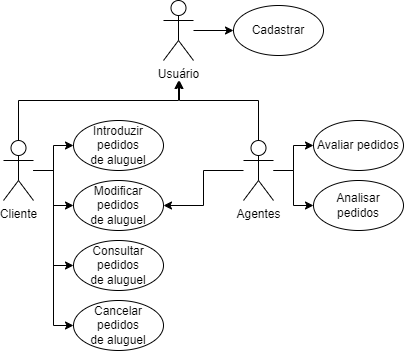
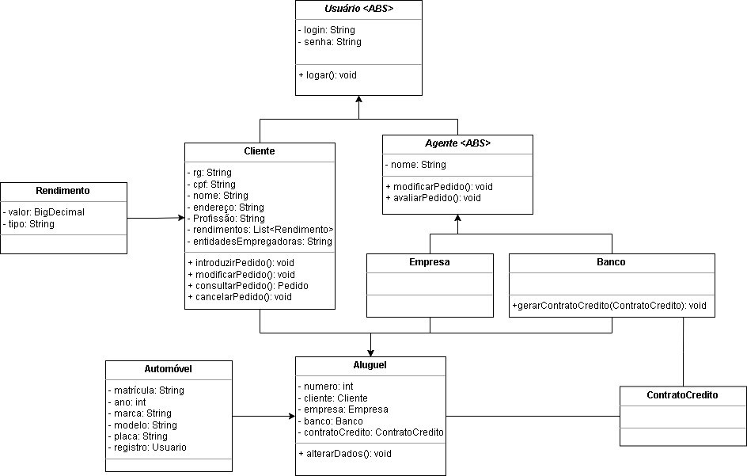
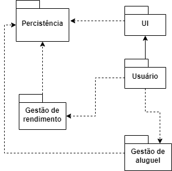

<h1 align="center">:file_cabinet: Laboratório de Desenvolvimento de Software</h1>

## :memo: Alunos:

- Ana Carolina de Carvalho Corrêa
- Henrique Pinto Santos
- Gabriel Pimentel Tabatinga

## :books: Funcionalidades

- <b>Funcionalidades</b>: Loading...

## :wrench: Tecnologias utilizadas

- Java;

## :rocket: Lab01S01:

Diagrama de Caso de Uso:  

Diagrama de Classes:  

Diagrama de Pacotes:  

 

- Meu nome é Nicole, tenho 24 anos e amo cuidar de planatas. Faço faculdade de design e preciso começar a trabalhar como motorista de aplicativo para pagar o curso, mas não tenho dinheiro para um financiamento, sendo assim, gostaria de alugar um carro.

* Meu nome é Lucas, tenho 19 anos e acabei de tirar carteira, meus pais alugaram um carro para mim mas gostaria de modificar o veículo do aluguel pois não gostei do carro.

- Meu nome é Andressa, tenho 45 anos e meu sonho é viajar o mundo. Gostaria de cancelar o meu pedido de aluguel pois não estarei aqui para utlizar o carro.

* Meu nome é Luiz Fernando, tenho 67 anos e faço coleção de figurinhas da copa do mundo. Gostaria de consultar as especificações do pedido de aluguel.

* Meu nome é Barbara, tenho 34 anos e 10 de carreira com o Banco do Brasil. Gostaria de simplificar o processo de como é feita a análise dos pedidos de aluguel.

* Meu nome é Rafael, tenho 42 anos e duas filhas de 10 e 14 anos. Gostaria de avaliar os pedidos de maneira mais rápida.

* Meu nome é Alex, tenho 26 anos, gosto de assistir filmes de suspense e drama. Gostaria de me cadastrar no sistema.

## :dart: Professor:

Danilo Boechat Seufitelli
